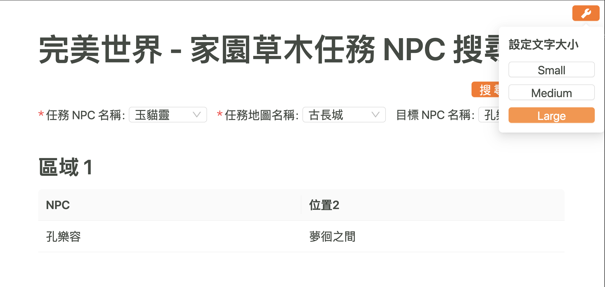

# 完美世界 - 家園草木任務 NPC 搜尋器

- [完美世界 - 家園草木任務 NPC 搜尋器](#完美世界---家園草木任務-npc-搜尋器)
  - [製作緣由](#製作緣由)
  - [如何使用？](#如何使用)
  - [備註](#備註)
  - [Development Note](#development-note)

## 製作緣由

家人最近在玩完美世界時碰到有一個叫做「家園草木」的任務。

這個任務基本上就是根據線索去出對應的 NPC 和地圖，但因為 NPC 及地圖數量並不少，所以你可能會上網搜尋攻略，然後就會看到某某攻略組製作的一張精美圖表，如下：


註：再次感謝攻略組的大大們，如果沒有這些資訊的話我也做不出這個搜尋系統。

雖然說有圖表後已經方便許多，但對長輩來說還是有幾個地方比較不友善：

1. 字太小，需要放很大才能看清楚圖上的字（原本是圖片格式，所以會有解析度的問題）
2. 圖表內容過多，沒辦法一眼就看出對應的 NPC 和地圖是哪一個

為了解決第一個問題，我第一個想到的是把「資訊搬移到網頁上」，這樣不管你要放多大都不會有解析度跑掉的問題，而第二個問題則是加上「關鍵字搜尋」的功能來解決，這樣子你就不需要自己用肉眼去比對你要找的 NPC 和位置，我覺得這不管是對長輩還是一般玩家都會直覺和方便許多。

結合以上，就做出了這樣的一個搜尋系統，希望各位會喜歡～

## 如何使用？

首先記得打開[搜尋系統](https://jubeatt.github.io/perfect-world-npc-search-system/)，接著按照下面步驟執行：

1. 選擇「任務 NPC 名稱」
2. 選擇「任務地圖名稱」
3. 選擇「目標 NPC 名稱」
4. 按下「搜尋」後，就會列出對應的 NPC 及地圖位置

小技巧：下拉選單的部分可以直接用文字搜尋來找出你要的選項

下面來做一段示範。

> 假設今天的任務 NPC 和地圖是「玉貓靈」和「古長城」，我們想找到「孔樂容」的所在位置


所以從搜尋結果我們就知道孔樂容今天在的位置是「夢徊之間」。

另外，一開始有提到這個系統其實是為了家中長輩而製作的，所以有特別加上「調整文字大小」的功能，可以點右上角的 🔧 來設定：



## 備註

雖然製作完以後我有自己先做一點基本測試，不過可能會是會有一些漏掉的地方。

如果各位在使用時有碰到任何問題，或者是覺得有哪裡可以改善的，都歡迎寄信給我，或者是直接在 GitHub 上開一個 Issue 也是可以的。

我的信箱：peanu01001@gmail.com

## Development Note

- Create by Vite
- Node (v14.21.2)
- React
- Ant Design v5
- TypeScript

1\. 安裝依賴項目：

```
npm ci
```

2\. 啟動伺服器：

```
npm run dev
```

3\. 打包與部署：

```
npm run build
npm run deploy
```
